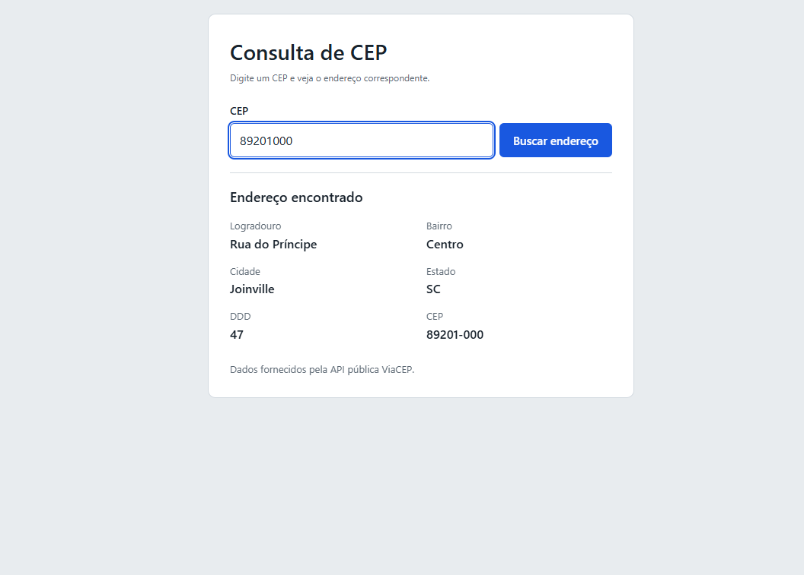

# Consulta de CEP

Página que consulta um CEP na API pública ViaCEP e mostra o endereço na tela.

## 1. Qual API foi usada

ViaCEP - documentação em https://viacep.com.br/

## 2. O que ela devolve

O endereço correspondente ao CEP: logradouro, complemento, bairro, cidade
(campo `localidade`), estado (`uf`), DDD.

## 3. O endereço que foi chamado

https://viacep.com.br/ws/89201000/json/

## 4. Como rodar

Baixe os três arquivos (`index.html`, `style.css` e `script.js`) na mesma pasta
e abra o `index.html` com duplo clique no navegador. Não precisa de servidor,
não precisa instalar nada e a API não exige cadastro nem chave de acesso.

## 5. Print da tela funcionando

## 6. Uma dificuldade que tive

Quando eu coloquei o botão dentro de um <form>, toda vez que eu clicava em buscar a página recarregava inteira e sumia com tudo que tinha na tela antes de eu conseguir ver o resultado. Demorei pra entender que isso é o comportamento padrão do form (dar submit e recarregar) e que eu precisava usar event.preventDefault() lá no início da função pra impedir isso.

## Estrutura da resposta

A ViaCEP devolve **um único objeto JSON**, não uma lista. Por isso o código
acessa os campos diretamente (`dados.localidade`, `dados.uf`), sem precisar de
laço de repetição nem de índice como `dados[0]`.

## Situações tratadas

- CEP com menos de 8 números, ou com letras: avisa antes de chamar a API
- CEP válido que não existe: trata o `{"erro": "true"}` da ViaCEP
- Erro no servidor da API: usa `resposta.ok` para detectar
- Falha de conexão: capturada pelo `catch`
- Endereço rural sem logradouro ou bairro: exibe "Não informado"

## Arquivos

- `index.html` — estrutura da página
- `style.css` — estilo
- `script.js` — requisição à API e exibição dos dados
